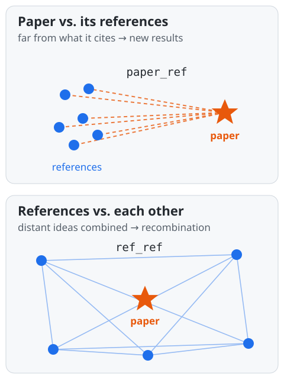

<!--
Skeleton for a 25-minute talk (~19 main slides + backup).
Build (Beamer):  pandoc slides.md -t beamer --slide-level=2 -o slides.pdf --pdf-engine=xelatex -V mainfont="DejaVu Serif"
Conventions: `# ` = section, `## ` = slide. [TODO] = content still to write, [FIG] = figure placeholder.
Time budget per section is given in the section comment; the total is 25 min.
-->

# Introduction

<!-- ~4 min, 3 slides -->

## Why measure novelty?

- **Research assessment & funding**: novelty is an explicit criterion in peer review and grant calls, but judged by hand, and inconsistently
- **Science of science**: how new ideas arise and spread; novel work tends to be recognised late (Wang et al. 2017)
- **Scale**: expert judgement does not scale to the millions of papers published each year, so we need indicators computable from metadata
- **Vocabulary**:
  - *novelty*: how far a paper departs from, or recombines, existing knowledge
  - *quality*: whether the work is sound
  - *impact*: whether it is taken up later (citations)

## What does "novel" mean?

- **Novelty as recombination**: new ideas are "new combinations" of existing ones (Schumpeter 1934)
- In bibliometrics: a paper is novel if it **cites unusual combinations** of prior work (Uzzi et al. 2013)
- The references stand in for the knowledge a paper builds on
- Two intuitions:
  - ***what* is combined**: how heterogeneous the cited material is (**recombination**)
  - ***how far*** the paper moves from what it cites (**conceptual distance**)
- These two need not coincide, so we measure them separately

## Talk outline

1. Existing novelty indicators
2. The novelty challenge
3. Our indicators: conceptual distance & recombination
4. Results: correlations
5. Conclusions

# Existing indicators

<!-- ~3.5 min, 3 slides -->

## Combinatorial indicators

- [TODO: Uzzi et al. 2013: atypical journal-pair combinations (z-scores)]
- [TODO: Lee et al. 2015: commonness of journal pairs]
- [TODO: Wang et al. 2017: new journal pairs, weighted by distance]
- [TODO: Foster et al. 2015: [one-line description]]
- [FIG: schematic: paper → references → journal pairs]

## Limitations of the combinatorial approach

- [TODO: discrete co-occurrence, depends on journal category schemes]
- [TODO: needs a reference corpus/baseline; weak for papers with few references]
- [TODO: ignores the *content* of references]

## Embedding-based alternatives

- [TODO: semantic distance in a continuous space instead of pair rarity]
- [TODO: prior work using embeddings for novelty: citations]
- [TODO: gap: usually reported as a single number; the choice of facet is implicit]

# The novelty challenge

<!-- ~2.5 min, 2 slides -->

## The challenge

- **Metascience Novelty Indicators Challenge**: launched Sept 2025
- **Goal**: indicators that *automatically* identify novelty in publications
- **Ground truth**: field experts rate novelty of OpenAlex papers from the full text
- **Task**: a novelty score per paper, compared with the expert scores
- **Evaluation**: median error and its consistency, for scores and rankings
- **Outcome**: 30 indicators; winner LENS (Jülich, LLM-based)
- We are loking forward to talk of Sarah Otner at 4 p.m.

## Data: the challenge corpus

- **100 000 papers**, metadata only: title, DOI, OpenAlex ID, journal, date, authors
- **Recent**: published 2023–2025 (10 % in 2023, 47 % in 2024, 43 % in 2025)
- **Broad, long-tailed journal mix**: 15 438 journals
  - median 2 papers per journal; 5 928 appear only once
  - largest: *Scientific Reports* (1.6 %), *PLoS ONE* (1.4 %), *Int. J. Mol. Sci.* (1.0 %); the top 100 journals hold 29 %
  - publishers: MDPI 20 %, Elsevier 13 %, Wiley 8 %, Frontiers 6 %
  - 76 % in open-access journals

## Data: what we could score

- Full texts were not feasible to download, so we work with **titles, abstracts and references from OpenAlex**

| Papers | Count | Share |
|:-------|------:|------:|
| Scored: title + abstract | 94 240 | 94.2 % |
| Scored: titles only (no abstracts) | 4 051 | 4.1 % |
| Not scored: no references | 1 455 | 1.5 % |
| Not scored: no valid references | 254 | 0.3 % |
| **Total** | **100 000** | |

- **98 291 papers (98.3 %) scored**

# Our indicators

<!-- ~5 min, 5 slides -->

## Motivation: two sources of novelty

- A paper builds on the knowledge it cites, so we compare it with its references in an embedding space
- **Paper vs. its references**: a paper far from what it cites brings **new results**
  - → *conceptual distance* (`paper_ref`)
- **References vs. each other**: distant references mean a **new combination of different ideas**
  - → *knowledge recombination* (`ref_ref`)
- The two need not coincide, so we measure them separately

## Why embeddings?

- An **embedding** maps a text (title + abstract) to a vector; similar meaning → nearby vectors
- **Distance = dissimilarity of content**: $1 - \cos(\mathbf{a}, \mathbf{b})$
  - e.g. *"graph neural networks for molecules"* is near *"message passing for chemistry"* despite few shared words
- **Why use them for novelty?**
  - *graded*: a continuous distance, not a rare/common journal pair
  - *content-based*: what papers say, not where they were published
  - *no category scheme or baseline corpus*: computable per paper
- **SPECTER2** is trained on citations: a paper lies close to the work it cites, so distance from it is meaningful

## Pipeline
- SPECTER2 embeddings (`allenai/specter2_base` + `specter2` adapter) of title + abstract
- References retrieved from OpenAlex; titles-only fallback when no abstract is available
- [FIG: pipeline diagram: paper → OpenAlex refs → SPECTER2 → distances]

## Conceptual distance: `paper_ref`

- $\text{paper\_ref} = 1 - \frac{1}{n}\sum_i \cos(\mathbf{r}_i, \mathbf{p})$
- How far the paper departs from the knowledge base it cites

- [FIG: 2-D sketch: paper point vs. cloud of references]
## Knowledge recombination: `ref_ref` and `ref_spread`

- `ref_ref`: mean pairwise $1 - \cos(\mathbf{r}_i, \mathbf{r}_j)$ over references: heterogeneity of the material combined
- `ref_spread`: standard deviation of the same pairwise matrix
- [FIG: 2-D sketch: tight vs. dispersed reference cloud]

## Descriptive statistics

- `paper_ref`: mean 0.093 (sd 0.017)
- `ref_ref`: mean 0.108 (sd 0.020)
- `ref_spread`: mean 0.040
- Median number of references: 25
- [FIG: F1: distributions of the three facets]

# Results

<!-- ~7 min, 5 slides -->

## Are the facets distinct?

- [TODO: inter-facet correlation matrix]
- [FIG: F2: correlation heatmap]

## Comparison with established indicators

- [TODO: correlations with Uzzi / Lee / Foster / Wang (novelpy)]
- [FIG: F3]

## Journal standing: paper level

- [TODO: key message: `ref_ref` weakly positive, `paper_ref` ≈ 0]
- [TABLE: SJR, quartile, h-index, cites/doc, OpenAlex citedness × facets (§5.3)]
- [FIG: F4: heatmap facets × journal metrics]

## Journal standing: journal level

- [TODO: `ref_ref` vs. SJR / citedness at ≥1, ≥5, ≥20 papers per journal]
- [FIG: F6: journal-level scatter, mean facet vs. SJR (log)]
- [FIG: F5: facet by SJR quartile, boxplots]
- [TODO: ecological-fallacy caveat]

## Composite indices depend on normalization

- [TODO: `novelty_max = max(norm(paper_ref), norm(ref_ref))`]
- [TABLE: normalization vs. share won by `ref_ref` vs. ρ (§5.5)]
- [TODO: key message: the reported correlation varies about fivefold with the normalization choice]

# Conclusion

<!-- ~2 min, 2 slides -->

## Take-home messages

- [TODO: conceptual distance and recombination behave differently]
- [TODO: report facets separately; state the normalization]
- [TODO: small effects: direction and consistency, not prediction]

## Limitations & next steps

- [TODO: field controls, second embedding model, bootstrap CIs, journal matching]

## Thank you

- [TODO: contact, links (HF Space, datasets), acknowledgement]

# Backup

## Backup: full correlation table

- [TABLE: T2]

## Backup: `ref_spread`

- [TODO]
