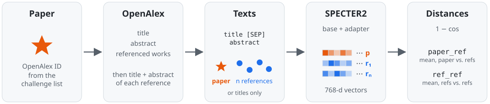
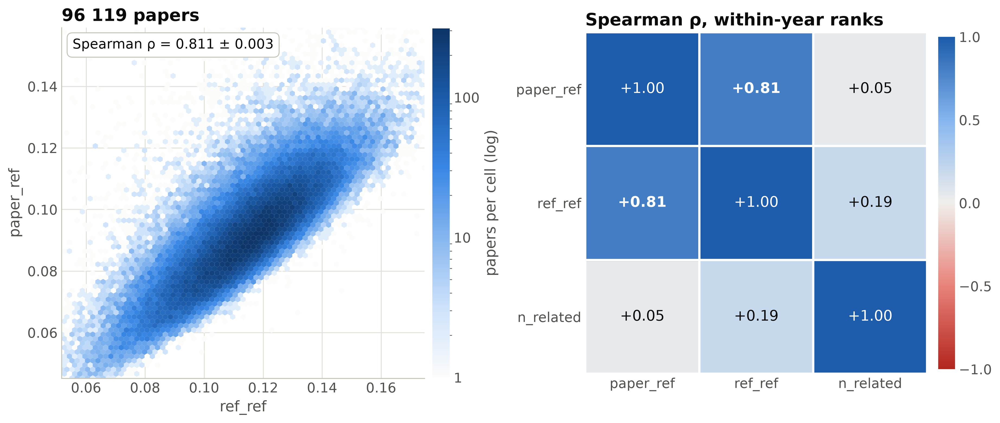
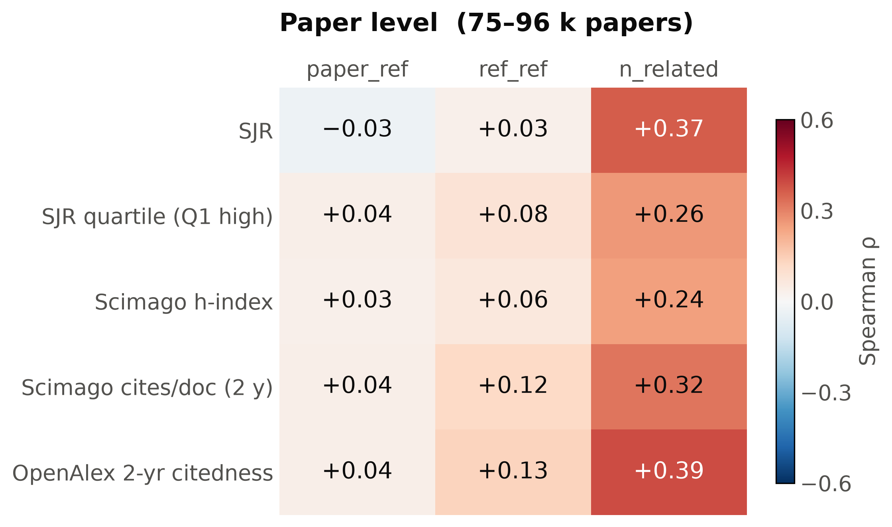
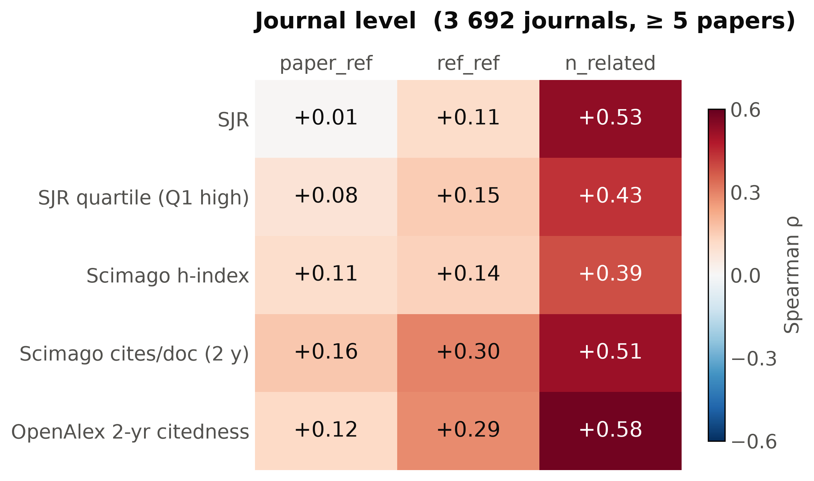
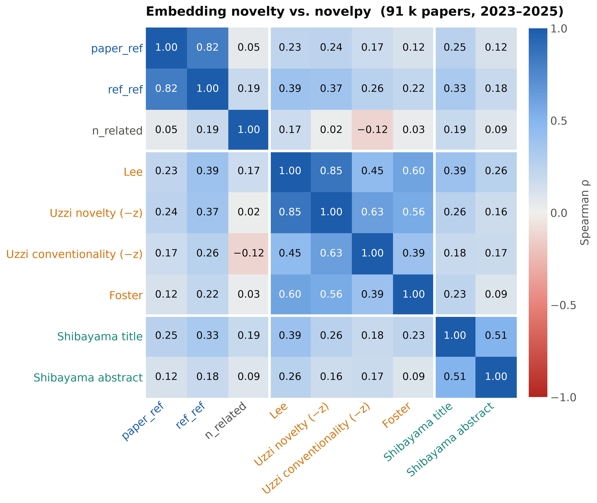
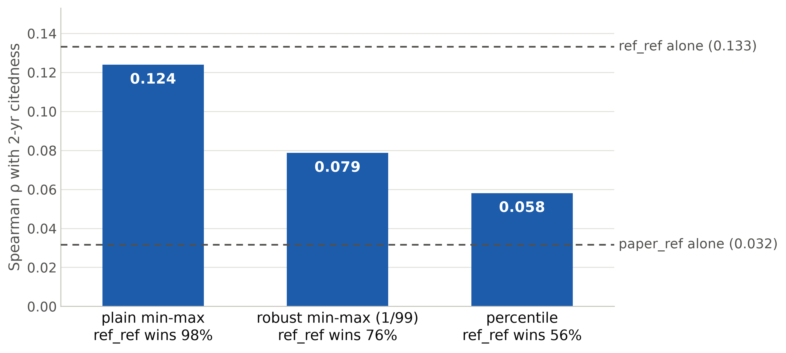

<!--
Skeleton for a 25-minute talk (~19 main slides + backup).
Build (Beamer):  pandoc slides.md -t beamer --slide-level=2 -o slides.pdf --pdf-engine=xelatex -V mainfont="DejaVu Serif"
Conventions: `# ` = section, `## ` = slide. [TODO] = content still to write, [FIG] = figure placeholder.
Time budget per section is given in the section comment; the total is 25 min.
-->

# Introduction

<!-- ~4 min, 3 slides -->

## Why measure novelty?

- **Research assessment & funding**: novelty is an explicit criterion in peer review and grant calls, but judged by hand, and inconsistently
- **Science of science**: how new ideas arise and spread; novel work tends to be recognised late (Wang et al. 2017)
- **Scale**: expert judgement does not scale to the millions of papers published each year, so we need indicators computable from metadata
- **Vocabulary**:
  - *novelty*: how far a paper departs from, or recombines, existing knowledge
  - *quality*: whether the work is sound
  - *impact*: whether it is taken up later (citations)

## What does "novel" mean?

- **Novelty as recombination**: new ideas are "new combinations" of existing ones (Schumpeter 1934)
- In bibliometrics: a paper is novel if it **cites unusual combinations** of prior work (Uzzi et al. 2013)
- The references stand in for the knowledge a paper builds on
- Two intuitions:
  - ***what* is combined**: how heterogeneous the cited material is (**recombination**)
  - ***how far*** the paper moves from what it cites (**conceptual distance**)
- These two need not coincide, so we measure them separately

## Talk outline

1. Existing novelty indicators
2. The novelty challenge
3. Our indicators: conceptual distance & recombination
4. Results: correlations
5. Conclusions

# Existing indicators

<!-- ~3.5 min, 3 slides -->

## Combinatorial indicators

- [TODO: Uzzi et al. 2013: atypical journal-pair combinations (z-scores)]
- [TODO: Lee et al. 2015: commonness of journal pairs]
- [TODO: Wang et al. 2017: new journal pairs, weighted by distance]
- [TODO: Foster et al. 2015: [one-line description]]
- [FIG: schematic: paper → references → journal pairs]

## Limitations of the combinatorial approach

- [TODO: discrete co-occurrence, depends on journal category schemes]
- [TODO: needs a reference corpus/baseline; weak for papers with few references]
- [TODO: ignores the *content* of references]

## Embedding-based alternatives

- [TODO: semantic distance in a continuous space instead of pair rarity]
- [TODO: prior work using embeddings for novelty: citations]
- [TODO: gap: usually reported as a single number; the choice of facet is implicit]

## novelpy

- **Indicators used** (novelpy 1.4): **Uzzi** 2013, **Lee** 2015, **Foster** 2015 (journal pairs), **Shibayama** 2021 (reference text distance)
  - Wang 2017 not computed: needs future citations, not yet available for 2023–25 papers
- **Why not novelpy directly?** computational and memory issues
- **Reimplementation**: same definitions and same full-OpenAlex baseline; counts are *stored* only for the ~9&nbsp;M pairs that challenge papers contain; fast pair counting (Numba), own Louvain

| Validated vs. novelpy on its sample data | |
|:--|:--|
| Lee, Shibayama | identical |
| Uzzi | Spearman 0.93 (random shuffling) |
| Foster | 0.79; two novelpy runs agree at 0.83 (random Louvain) |

# The novelty challenge

<!-- ~2.5 min, 2 slides -->

## The challenge

- **Metascience Novelty Indicators Challenge**: launched Sept 2025
- **Goal**: indicators that *automatically* identify novelty in publications
- **Ground truth**: field experts rate novelty of OpenAlex papers from the full text
- **Task**: a novelty score per paper, compared with the expert scores
- **Evaluation**: median error and its consistency, for scores and rankings
- **Outcome**: 30 indicators; winner LENS (Jülich, LLM-based)
- We are loking forward to talk of Sarah Otner at 4 p.m.

## Data: the challenge corpus

- **100 000 papers**, metadata only: title, DOI, OpenAlex ID, journal, date, authors
- **Recent**: published 2023–2025 (10 % in 2023, 47 % in 2024, 43 % in 2025)
- **Broad, long-tailed journal mix**: 15 438 journals
  - median 2 papers per journal; 5 928 appear only once
  - largest: *Scientific Reports* (1.6 %), *PLoS ONE* (1.4 %), *Int. J. Mol. Sci.* (1.0 %); the top 100 journals hold 29 %
  - publishers: MDPI 20 %, Elsevier 13 %, Wiley 8 %, Frontiers 6 %
  - 76 % in open-access journals

## Data: what we could score

- Full texts were not feasible to download, so we work with **titles, abstracts and references from OpenAlex**

| Papers | Count | Share |
|:-------|------:|------:|
| Scored: title + abstract | 94 240 | 94.2 % |
| Scored: titles only (no abstracts) | 4 051 | 4.1 % |
| Not scored: no references | 1 455 | 1.5 % |
| Not scored: no valid references | 254 | 0.3 % |
| **Total** | **100 000** | |

- **98 291 papers (98.3 %) scored**

# Our indicators

<!-- ~5 min, 5 slides -->

## Motivation: two sources of novelty

- A paper builds on the knowledge it cites, so we compare it with its references in an embedding space
- **Paper vs. its references**: a paper far from what it cites brings **new results**
  - → *conceptual distance* (`paper_ref`)
- **References vs. each other**: distant references mean a **new combination of different ideas**
  - → *knowledge recombination* (`ref_ref`)
- The two need not coincide, so we measure them separately

## Why embeddings?

- An **embedding** maps a text (title + abstract) to a vector; similar meaning → nearby vectors
- **Distance = dissimilarity of content**: $1 - \cos(\mathbf{a}, \mathbf{b})$
  - e.g. *"graph neural networks for molecules"* is near *"message passing for chemistry"* despite few shared words
- **Why use them for novelty?**
  - *graded*: a continuous distance, not a rare/common journal pair
  - *content-based*: what papers say, not where they were published
  - *no category scheme or baseline corpus*: computable per paper
- **SPECTER2** is trained on citations: a paper lies close to the work it cites, so distance from it is meaningful

## Pipeline

- **SPECTER2** (`allenai/specter2_base` + `specter2` adapter) embeds the paper and each of its references
- **Titles-only fallback** if the paper has no abstract not enough references have one
- Unsupervised: OpenAlex metadata only, no full texts, no model training

## `paper_ref` and `ref_ref` in the corpus

**Conceptual distance**

$$
\text{paper\_ref} = 1 - \frac{1}{n}\sum_i \cos(\mathbf{r}_i, \mathbf{p})
$$

**Recombination**

$$
\text{ref\_ref} = \frac{1}{n(n-1)}\sum_{i \neq j} \bigl(1 - \cos(\mathbf{r}_i, \mathbf{r}_j)\bigr)
$$

- References per paper: median 25 (IQR 15–39)
- In 89 % of papers the references are further from **each other** than from the **paper** citing them

# Results

<!-- ~7 min, 5 slides -->

## Are the facets distinct?

`paper_ref` measures distance to a cloud whose size is `ref_ref`. Broad reference lists make every paper look far from its references, so most of `paper_ref`'s variance is `ref_ref` again.

## Journal metrics we have

Does novelty just track the prestige or impact of the journal?

| Source | Metrics | Coverage |
|:-------|:--------|:---------|
| **OpenAlex** `/sources` (open API) | 2-yr mean citedness (open analogue of the Impact Factor), h-index, i10-index, works count, total citations, APC (USD) | 15 412 / 15 438 journals, **99.9 %** of papers |
| **Scimago 2025** (free CSV, Scopus-based) | SJR (PageRank-like prestige), best quartile Q1–Q4, h-index, cites/doc (2 yr) | 10 128 journals, **80 %** of papers |

- 10 metrics in total: **prestige** (SJR, quartile), **impact per paper** (citedness, cites/doc), **cumulative volume** (h-index ×2, i10-index, works, total citations), and **cost** (APC)
- Clarivate JIF is proprietary, so not used

## Journal standing: paper level

- [TODO: key message: `ref_ref` weakly positive, `paper_ref` ≈ 0]

## Journal standing: journal level

- [TODO: `ref_ref` vs. SJR / citedness at ≥1, ≥5, ≥20 papers per journal]
- [FIG: F5: facet by SJR quartile, boxplots]
- [TODO: ecological-fallacy caveat]

## Comparison with established indicators

- `ref_ref` agrees moderately with established indicators (ρ 0.18–0.39); `paper_ref` agrees less (0.12–0.25)

## Composite indices depend on normalization

- Composite `novelty_max = max(norm(paper_ref), norm(ref_ref))`: the normalization decides which component wins the max
- Same data, different normalization: ρ with journal citedness **halves** (0.124 → 0.058), and never beats `ref_ref` alone

# Conclusion

<!-- ~2 min, 2 slides -->

## Take-home messages

- **Cheap and scalable**: open metadata only (titles, abstracts, references), no full texts, no training
- applicable **at the time of publication**: does not depend on the focal paper's citations
- **Consistent with established indicators**: `ref_ref` ρ 0.18–0.39 with Uzzi, Lee, Foster, Shibayama; `paper_ref` weaker
- **Report facets separately**: a composite depends on the normalization, so state it or avoid it

## Limitations & next steps

**Limitations**

- Titles and abstracts only, no full texts (4 % of papers titles-only)
- One embedding model (SPECTER2)
- The facets overlap (ρ = 0.81)
- Recent papers (2023–25): no citation-based validation yet

**Next steps**

- Disentangle the facets: distance from the references *beyond* their spread
- Control for field and reference count; bootstrap confidence intervals
- Second embedding model as a robustness check
- Validate against the challenge's expert ratings and, later, citations

## Thank you

<!-- _paginate: false -->

Questions?

petra@cs.cas.cz
[github.com/PetraVidnerova/TRUST_score_app](https://github.com/PetraVidnerova/TRUST_score_app)

This work was supported by the project 'Knowledge in the Age of Distrust' (reg. no. CZ.02.01.01/00/23_025/0008711) financed by the European Regional Development Fund.

